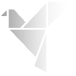

# Pioneer Brand Assets

Complete icon and logo asset library for the Pioneer brand, optimized for all platforms and use cases.

## 📁 Directory Structure

```
art/
├── icons-color/          # Full-color gradient icons (green)
├── icons-black/          # Black variant icons
├── icons-white/          # White variant icons (black iOS background)
├── pioneer-logo.svg      # Color logo mark (geometric shape only)
├── pioneer-logo-black.svg    # Black logo mark
├── pioneer-logo-white.svg    # White logo mark
├── pioneer-text.svg      # Color text logo (wordmark with gradient)
├── pioneer-text-white.svg    # White text logo
└── pioneer-text-logo-black.svg  # Black text logo
```

---

## 🎨 Icon Variants

### Color Icons (`icons-color/`)
Full-color gradient green icons for standard use cases.

  

### Black Icons (`icons-black/`)
Monochrome black icons for light backgrounds or minimalist designs.

  

### White Icons (`icons-white/`)
White icons for dark backgrounds (iOS icons have black background for visibility).

  

---

## 🖥️ Desktop Icons

### Standard PNG Icons

| Icon | Size | Path | Use Case |
|------|------|------|----------|
|  | 32×32 | `icons-*/32x32.png` | Small app icons, taskbar, system tray |
|  | 64×64 | `icons-*/64x64.png` | Medium app icons, file managers |
|  | 128×128 | `icons-*/128x128.png` | Large app icons, standard resolution |
|  | 256×256 | `icons-*/128x128@2x.png` | Retina/HiDPI displays (128×128 @2x) |
|  | 512×512 | `icons-*/icon.png` | High-resolution icon, app stores |

### Platform-Specific Bundles

#### macOS Icons (`.icns`)
**Path:** `icons-*/icon.icns`

**Use:** macOS application bundles (`.app` files)

**Contains:** Multi-resolution icon set (16px to 1024px) in a single file

**How to use:**
```json
// In tauri.conf.json
{
  "bundle": {
    "icon": ["icons-color/icon.icns"]
  }
}
```

#### Windows Icons (`.ico`)
**Path:** `icons-*/icon.ico`

**Use:** Windows executables (`.exe`), shortcuts, and **favicons** for websites

**Contains:** Multiple sizes (16, 24, 32, 48, 64, 256px) in a single file

**How to use:**
- **Desktop apps:** Embedded in `.exe` during build
- **Websites (favicon):** 
  ```html
  <link rel="icon" href="icons-color/icon.ico" type="image/x-icon">
  ```

**Note:** For modern web favicons, consider using PNG instead:
```html
<link rel="icon" type="image/png" sizes="32x32" href="icons-color/32x32.png">
<link rel="icon" type="image/png" sizes="128x128" href="icons-color/128x128.png">
```

---

## 🪟 Windows Store Icons

For Microsoft Store / AppX packages:

| Icon | Size | Path | Use Case |
|------|------|------|----------|
|  | 30×30 | `icons-*/Square30x30Logo.png` | Small tile |
|  | 44×44 | `icons-*/Square44x44Logo.png` | App list icon |
|  | 71×71 | `icons-*/Square71x71Logo.png` | Small tile (71×71) |
|  | 89×89 | `icons-*/Square89x89Logo.png` | Small tile (89×89) |
|  | 107×107 | `icons-*/Square107x107Logo.png` | Small tile (107×107) |
|  | 142×142 | `icons-*/Square142x142Logo.png` | Medium tile (142×142) |
|  | 150×150 | `icons-*/Square150x150Logo.png` | Medium tile |
|  | 284×284 | `icons-*/Square284x284Logo.png` | Large tile (284×284) |
|  | 310×310 | `icons-*/Square310x310Logo.png` | Large tile |
|  | 50×50 | `icons-*/StoreLogo.png` | Microsoft Store listing |

---

## 📱 iOS Icons

**Path:** `icons-*/ios/AppIcon-*.png`

**Use:** iOS/iPadOS app icons for Xcode projects

**Destination:** Copy to `src-tauri/gen/apple/Assets.xcassets/AppIcon.appiconset/`

### Icon Sizes

| Size | 1x | 2x | 3x | Extra 2x | Use Case |
|------|----|----|----|---------|----|
| **20pt** |  20px |  40px |  60px |  | Notification icon (iOS) |
| **29pt** |  29px |  58px |  87px |  | Settings icon |
| **40pt** |  40px |  80px |  120px |  | Spotlight search |
| **60pt** | — |  120px |  180px | — | iPhone app icon |
| **76pt** |  76px |  152px | — | — | iPad app icon |
| **83.5pt** | — |  167px | — | — | iPad Pro app icon |
| **512pt** | — |  1024px | — | — | App Store |

**Important:** iOS icons have **no transparency** - they are filled with the specified background color (white for color/black variants, black for white variant).

---

## 🤖 Android Icons

**Path:** `icons-*/android/mipmap-*/`

**Use:** Android app icons for Android Studio projects

**Destination:** Copy to `src-tauri/gen/android/app/src/main/res/`

### Density Variants

| Density | DPI | Launcher | Round | Foreground | Use Case |
|---------|-----|----------|-------|------------|----------|
| **mdpi** | ~160 |  48px |  48px |  108px | Low-density screens |
| **hdpi** | ~240 |  72px |  72px |  162px | Medium-density screens |
| **xhdpi** | ~320 |  96px |  96px |  216px | High-density screens |
| **xxhdpi** | ~480 |  144px |  144px |  324px | Extra-high-density screens |
| **xxxhdpi** | ~640 |  192px |  192px |  432px | Extra-extra-high-density screens |

### Icon Types

- **`ic_launcher.png`** - Standard square launcher icon
- **`ic_launcher_round.png`** - Circular launcher icon (for devices with round icon support)
- **`ic_launcher_foreground.png`** - Foreground layer for adaptive icons (Android 8.0+)

### Adaptive Icons

Android 8.0+ uses adaptive icons with separate foreground and background layers:

**Configuration files:**
- `mipmap-anydpi-v26/ic_launcher.xml` - Adaptive icon configuration
- `values/ic_launcher_background.xml` - Background color definition

---

## 🎯 Quick Reference: When to Use Each Icon

### Web Development
- **Favicon (legacy):** `icons-color/icon.ico` (16×16, 32×32 layers)
- **Favicon (modern):** `icons-color/32x32.png` and `icons-color/128x128.png`
- **Apple Touch Icon:** `icons-color/icon.png` (512×512, will be resized)
- **PWA Manifest:** `icons-color/icon.png`, `icons-color/128x128.png`, `icons-color/128x128@2x.png`

### Desktop Apps (Tauri)
- **macOS:** `icons-color/icon.icns`
- **Windows:** `icons-color/icon.ico`
- **Linux:** `icons-color/32x32.png`, `icons-color/128x128.png`, `icons-color/icon.png`

### Mobile Apps
- **iOS (Xcode):** All files in `icons-color/ios/`
- **Android (Android Studio):** All files in `icons-color/android/`

### App Stores
- **Apple App Store:** `icons-color/ios/AppIcon-512@2x.png` (1024×1024)
- **Google Play Store:** `icons-color/icon.png` (512×512)
- **Microsoft Store:** `icons-color/StoreLogo.png` and Square logos

---

## 🛠️ Tauri Configuration

To use these icons in your Tauri app, add to `tauri.conf.json`:

```json
{
  "bundle": {
    "icon": [
      "icons-color/32x32.png",
      "icons-color/128x128.png",
      "icons-color/128x128@2x.png",
      "icons-color/icon.icns",
      "icons-color/icon.ico"
    ]
  }
}
```

For mobile platforms, Tauri automatically places icons in the correct locations when you run:
```bash
cargo tauri android init
cargo tauri ios init
```

---

## 📝 Source Files

### Logo Marks (Geometric Shape Only)
- `pioneer-logo.svg` - Full-color gradient (927KB, contains embedded PNG)
- `pioneer-logo-black.svg` - Black variant (632KB, contains embedded PNG)
- `pioneer-logo-white.svg` - White variant (625KB, contains embedded PNG)

### Text Logos (Wordmark)
- `pioneer-text.svg` - Full-color gradient with custom typography (7.9KB)
- `pioneer-text-logo-black.svg` - Black variant (7.4KB)
- `pioneer-text-white.svg` - White variant (7.3KB)

**Note:** Text logos are not square and are intended for branding/marketing use, not app icons.

---

## 🔄 Regenerating Icons

To regenerate all icons from source SVGs:

```bash
cd /Users/zhorton/art

# Color icons
cargo tauri icon pioneer-logo.svg -o icons-color -v

# Black icons
cargo tauri icon pioneer-logo-black.svg -o icons-black -v

# White icons (with black iOS background)
cargo tauri icon pioneer-logo-white.svg -o icons-white --ios-color "#000000" -v
```

---

## 📊 Asset Statistics

- **Total icon variants:** 3 (color, black, white)
- **Icons per variant:** ~60+ files
- **Total icons generated:** ~180+ files
- **Platforms supported:** macOS, Windows, Linux, iOS, Android, Web
- **Formats:** PNG, ICNS, ICO, XML

---

## 🎨 Brand Colors

### Primary Gradient (Color Icons)
- Start: `#2D7A3E` (Dark Green)
- Middle: `#4A9D5F` (Medium Green)
- End: `#7CB342` (Light Green)

### iOS Background Colors
- Color/Black icons: `#FFFFFF` (White)
- White icons: `#000000` (Black)

---

## 📄 License

Pioneer brand assets - All rights reserved.
